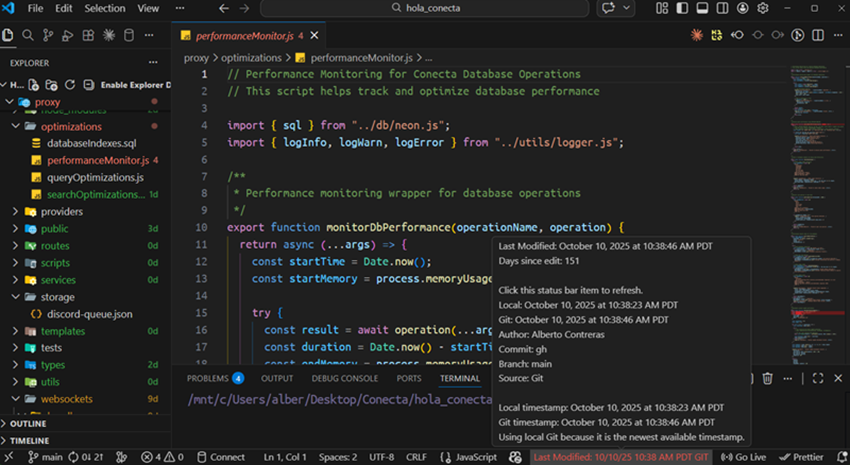

# File Last Modified

File Last Modified shows the last modified date for files in VS Code using a status bar timestamp, Explorer badge, and Git-aware hover details. It helps you spot recent files, stale files, and active code paths without leaving the editor.

## Overview

The extension adds file recency information in two places:

- Status Bar: Displays the last modified date of the active file.
- File Explorer: Shows how many days ago each file was modified.

Hovering over the status bar also shows the number of days since the last change, the local file timestamp, and the local Git timestamp.

It works by reading local file metadata and, when available, local Git history for the current file.

## Why This Extension Exists

This extension was created while cleaning large repositories with many similarly named files. Determining which files were current versus older versions often required repeatedly checking file details or Git history.

File Last Modified keeps that information visible inside the editor so developers can quickly identify newer files and older code.

## Features

### Status Bar

Displays the last modified date of the active file and changes color based on how recent the file is.

### File Explorer

Shows the number of days since each file was last modified, for example `2d` or `45d`, making it easy to scan folders and identify newer versus older files.

Explorer filename labels are tinted by default using the file age colors. If you prefer badge-only decorations, disable `fileLastUpdated.colorizeExplorerLabels`.

If Explorer badges or colors are disabled in VS Code, the extension will offer to enable the required settings the first time it runs. You can also trigger this manually with the `File Last Modified: Enable Explorer Decorations` command.

### Hover Tooltip

Hovering over the status bar reveals:

- Days since last modification
- Local and Git timestamps
- Commit metadata when available
- A click hint so the `Last Modified` status bar item can be refreshed directly

### Timestamp Detection

The extension can determine modification time using:

- Local file metadata
- Git commit history
- GitHub commit history for GitHub-backed repositories

### Performance

File Last Modified is lightweight and fast. It checks only the active file and required metadata rather than scanning the entire workspace, keeping the editor responsive.

## Preview

## Search Phrases

- VS Code last modified date
- show last modified file vscode
- VS Code file timestamp
- VS Code Explorer badge
- VS Code status bar file date
- git last modified file
- file history vscode
- VS Code file history

## Install

Install from the Visual Studio Marketplace or from a .vsix package.

## Command

- `File Last Modified: Refresh`
- `File Last Modified: Enable Explorer Decorations`

## License

All rights reserved. See `LICENSE.txt`.
